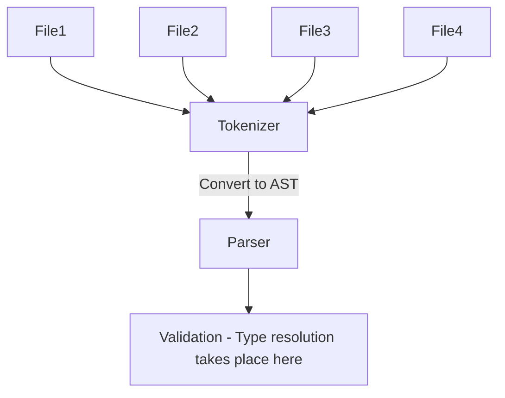

```mermaid
flowchart TD
    File1 
    File2
    File3
    File4
    
    Tokenizer
    
    File1 --> Tokenizer
    File2 --> Tokenizer
    File3 --> Tokenizer
    File4 --> Tokenizer

    Tokenizer -- Convert to AST --> Parser["Parser"]
    
    Parser --> Validation["Validation - Type resolution takes place here"]
```